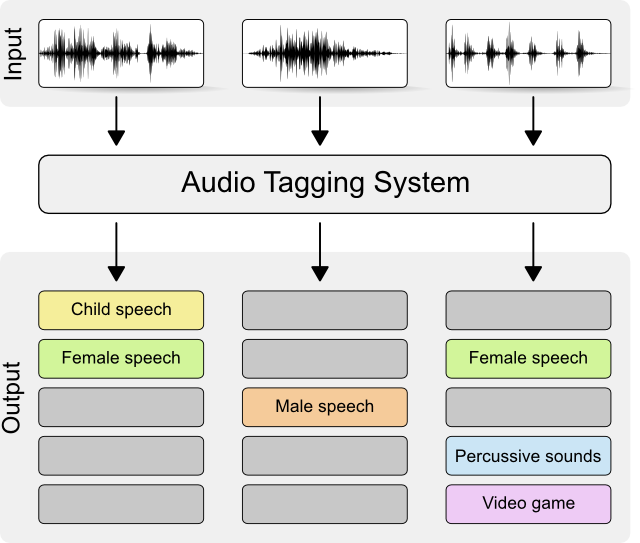

# Urban Sound Tagging Project

<center>

</center>


## Introduction

In this project, we develop a urban sound tagging system. Given a ten-second audio recording from some urban environment, it will return whether each of the following eight predefined audio sources is audible or not:

1. engine    
2. machinery-impact   
3. non-machinery-impact    
4. powered-saw    
5. alert-signal    
6. music    
7. human-voice    
8. dog

The mel spectrograms of the sound recordings are computed to be used in our model.

<center>

</center>


## Setup Instructions

- Clone this Github repository:
  
  ```git clone https://github.com/LouisLeDain/urban-sound-tagging```
- Edit the variable ```root_path``` in ```baseline/paths.py``` so that it corresponds to the path of the folder `urban-sound-tagging` in your environment.
- Run the python file `setup.py` This file will install the Python libraries listed in `requirements.txt` (most of them should already be installed) and it will download the [SONYC-UST dataset](https://zenodo.org/record/2590742#.XIkTPBNKjuM).

### Framework

You will find in the baseline folder the notebook ```final_framework.py``` which describes my proposed solution for the challenge. It consists of a feature extraction model followed by a GRU model strenghened with an attention mechanism.

## Results

The ```output``` folder contains different elements of results obtained with the proposed framework.
You can read a deeper description of the proposed framework in the ``IA_DL_paper-2.pdf```file.
<center>

</center>
